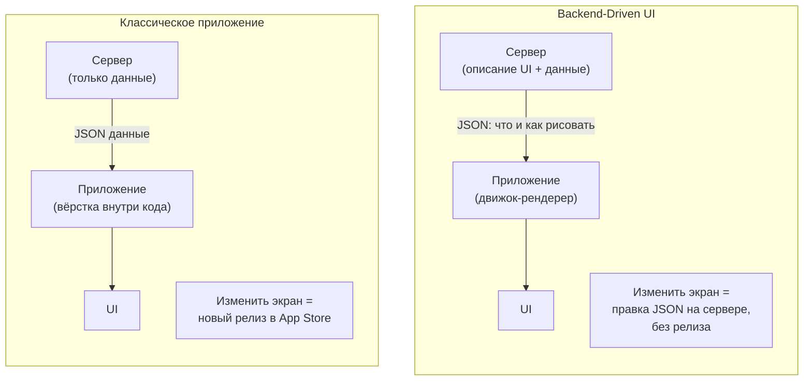
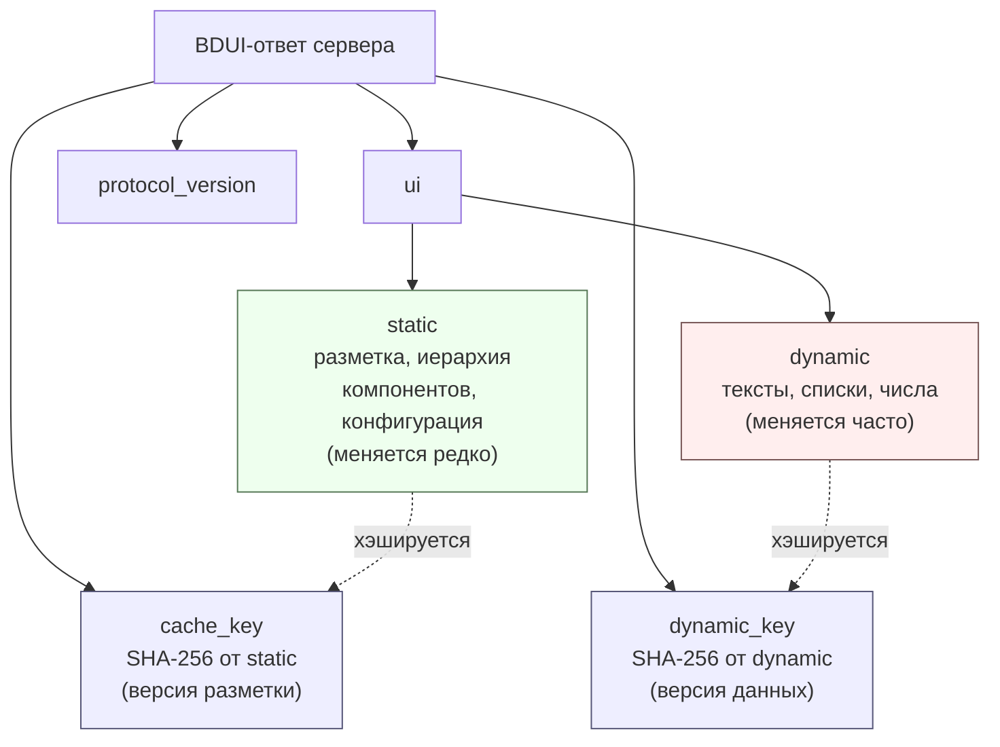
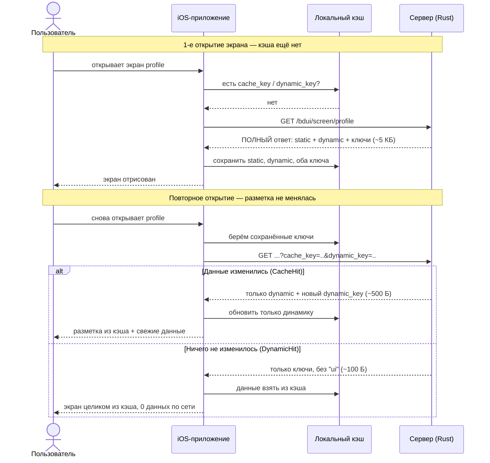
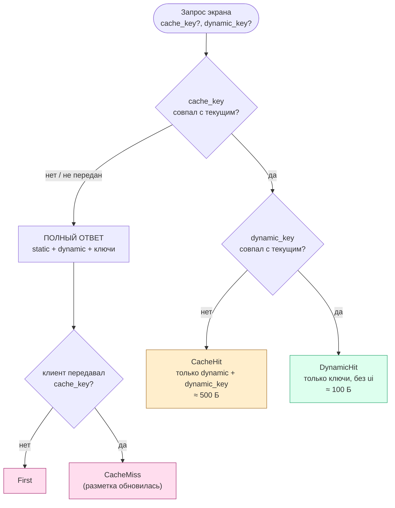
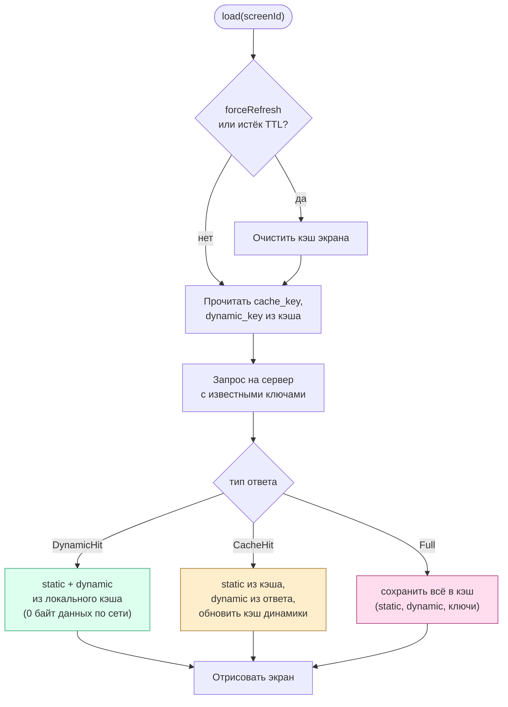
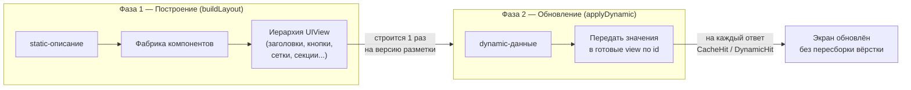

# Диаграммы работы BDUI

Исходники в формате [Mermaid](https://mermaid.live). Чтобы получить картинку: открой
https://mermaid.live, вставь нужный блок — справа экспорт в PNG/SVG для Word.
На GitHub эти блоки рендерятся автоматически.

---

## 1. Суть BDUI: кто описывает интерфейс

Классический подход против Backend-Driven UI. В обычном приложении вёрстка «зашита»
в клиент, и любое изменение требует релиза в App Store. В BDUI описание экрана
живёт на сервере, а клиент — это универсальный «движок отрисовки».

---

## 2. Из чего состоит BDUI-ответ

Описание экрана делится на неизменную разметку (`static`) и обновляемые данные
(`dynamic`). К ним добавляются два хэша-идентификатора версий.

---

## 3. Главный флоу: что видит пользователь при открытии экрана

Трёхуровневое кэширование. Чем больше совпало ключей — тем меньше данных по сети.
Это основная диаграмма «как работает приложение».

---

## 4. Решение сервера: какой ответ вернуть

Серверный алгоритм выбора одного из четырёх уровней.

---

## 5. Решение клиента: откуда брать данные

Клиентский загрузчик `BDUIScreenLoader` обрабатывает три ветки ответа.

---

## 6. Рендеринг в две фазы

Почему обновление дешёвое: разметка строится один раз, дальше меняется только контент.

